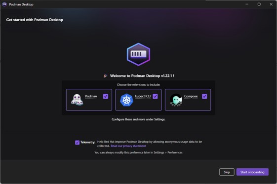
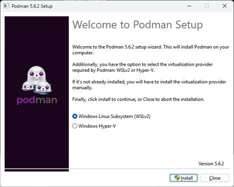
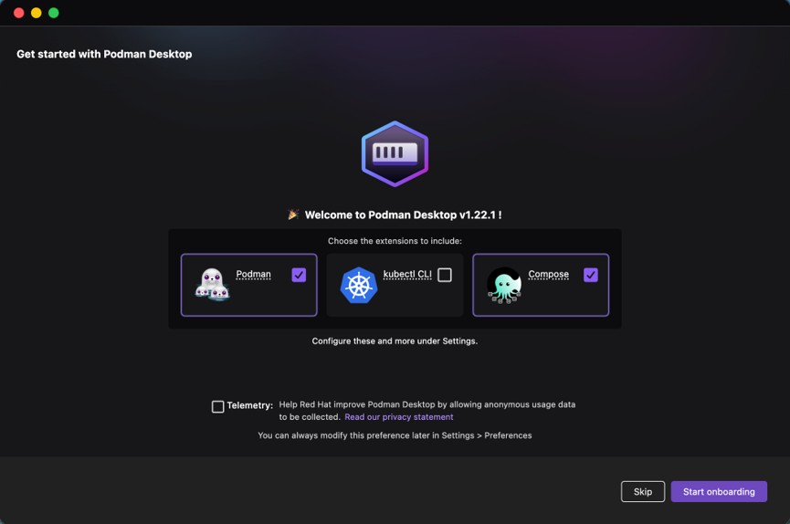
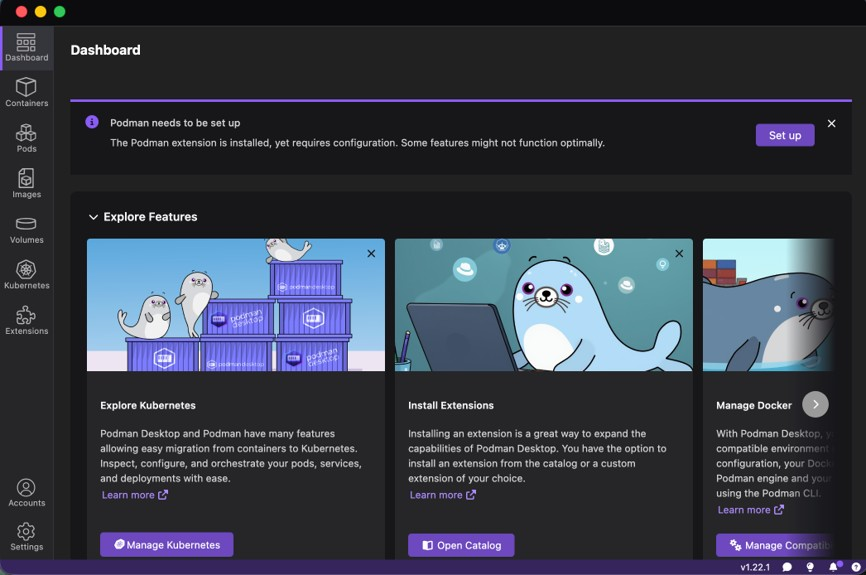

# 演習環境構築（Podman）

## 必要なソフトウェアのインストール（Windows,Macで別作業）

### Windows向け
1. Podman Desktop ([https://podman-desktop.io]())からインストーラをダウンロード・インストール．
1. Podman, Composeにチェックがついている状態で，Start onboarding.  
      
1. 適当に進めて，Windows Linux Subsystem (WSLv2)でinstall.  
    
1. 基本Nextで，Podman・Composeのインストールを最後まで進める．
1. podman-machine-defaultをWSLのデフォルトに変更  
  （他の講義・実験で不都合があれば，wsl --set-default Ubuntu-22.04などで元に戻してください。）
```powershell
C:\Users\morita\workspace>wsl --list
Linux 用 Windows サブシステム ディストリビューション:
Ubuntu-22.04 (既定値)
podman-machine-default

C:\Users\morita\workspace>wsl --set-default podman-machine-default
この操作を正しく終了しました。

C:\Users\morita\workspace>wsl --list
Linux 用 Windows サブシステム ディストリビューション:
podman-machine-default (既定値)
Ubuntu-22.04
```

6. podman-machine-defaultを起動してpodman-composeをインストール
```powershell
[user@DESKTOP-QF8BOV0]$ sudo dnf install –y podman-compose
```

### MacOS向け
1. Podman Desktop ([https://podman-desktop.io]())からインストーラをダウンロード・インストール．
1. Podman, Composeにチェックがついている状態で，Start onboarding.  
    
1. インストール後にSet upを継続  
    
1. `brew`で`pipx`をインストールし
```bash
[morita@m1mac]$ brew install pipx
[morita@m1mac]$ pipx ensurepath
```
5. `pipx`で`podman-compose`をインストール
```bash
[morita@m1mac]$ pipx install "git+https://github.com/containers/podman-compose.git"
[morita@m1mac]$ type podman-compose
podman-compose is ...
```

---
## 演習環境の確認（ここからはWindows,Mac共通）
1. PodmanでMYSQLコンテナの実行
    - Windows:	WSL (podman-machine-default) 内で実行
    - MacOS:    通常のTerminalで実行

```bash
[user@DESKTOP-QF8BOV0 ~]$ podman run -p 3306:3306 -e MYSQL_ROOT_PASSWORD=password --name sql_server docker.io/library/mysql:9.5.0
…色々出てくる
```

2. Podmanで立ち上げたMYSQLコンテナへのアクセス  
    ↑のターミナルで新規のコマンドは実行できないので、新しくWSL or Terminalを立ち上げて実行

```bash
[user@DESKTOP-QF8BOV0 ~]$ podman ps
CONTAINER ID  IMAGE                          COMMAND     CREATED         STATUS         PORTS                              NAMES
26d360cb631d  docker.io/library/mysql:9.5.0  mysqld      26 seconds ago  Up 26 seconds  0.0.0.0:3306->3306/tcp, 33060/tcp  sql_server

[user@DESKTOP-QF8BOV0 ~]$ podman exec -it sql_server mysql -hlocalhost -uroot -p
Enter password:
Welcome to the MySQL monitor.  Commands end with ; or \g.
Your MySQL connection id is 9
Server version: 9.5.0 MySQL Community Server - GPL

Copyright (c) 2000, 2025, Oracle and/or its affiliates.

Oracle is a registered trademark of Oracle Corporation and/or its
affiliates. Other names may be trademarks of their respective
owners.

Type 'help;' or '\h' for help. Type '\c' to clear the current input statement.

mysql> show databases;
+--------------------+
| Database           |
+--------------------+
| information_schema |
| mysql              |
| performance_schema |
| sys                |
+--------------------+
4 rows in set (0.008 sec)

mysql> exit;
```

